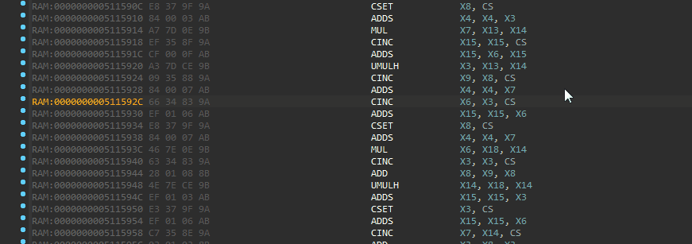

# Describe Key - Quickly learn what a shortcut does

## Overview

Describe Key is a very simple 
[IDA Pro](https://www.hex-rays.com/products/ida/) plugin: invoke it, 
press a shortcut, and instantly see what actions are associated with 
the shortcut. Quick and easy, call it from anywhere in IDA.

Describe Key is a single-file IDAPython plugin with no external
dependencies. As such, it should work on all platforms supported by IDA.

## Installation

Simply copy `describekey.py` to your plugins directory and restart IDA.

_(Alternatively, you could execute `describekey.py` as a script and call
`describekey.register_action()` to load it manually)_

## Usage

From anywhere in IDA, press `Alt-Shift-K` to bring up the Describe Key 
dialog and press keys to your heart's content. Be enlightened as you
discover all what those keys can do!

Press `Esc` to close the dialog.

## Note

Not being a Qt expert, I can't guarantee that the conversion from a Qt 
keypress event to an IDA shortcut is very robust. It is thus likely you
might bump into some shortcuts that don't get recognized properly and
give you the wrong (or no) action. Please let me know if you run into
such a case.

## Authors

* Vincent Mallet ([vmallet](https://github.com/vmallet))